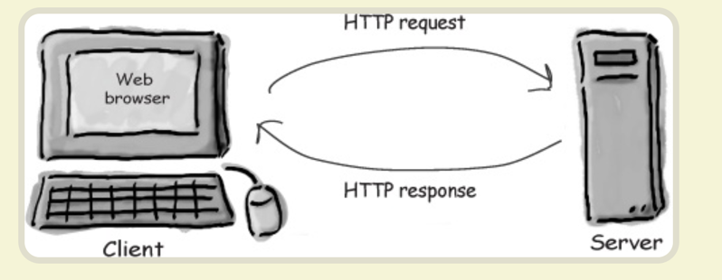
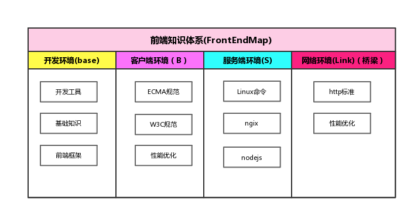
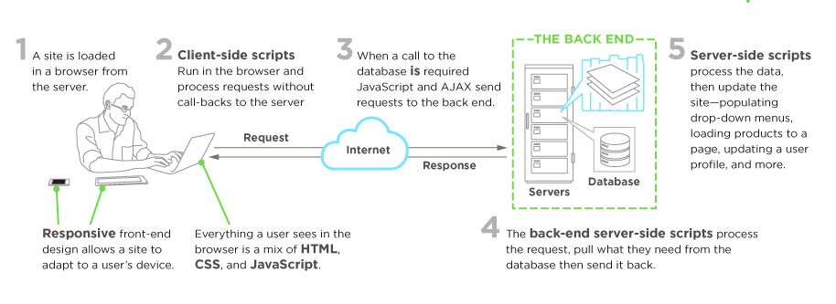

# 前端知识架构体系

---

---

---

# 一：开发环境

---

### 1.1、开发工具

* Git
* Vscode

### 1.2、基础知识

* 算法
* 数据结构
* 面向对象
* 设计模式

### 1.3、前端框架

* [**Vue**](https://zhouxianfei.gitee.io/gitbook-front/vue/)
* [**React**](https://zhouxianfei.gitee.io/gitbook-front/react/)
* Angular

### 1.4、脚手架

* vueCli
* create-react-app

# 二：客户端环境

---

#### 2.1、[前端标准](https://zhouxianfei.gitee.io/gitbook-front/frontEndMap/webStandard)

* W3C标准
* ECMA标准

#### 2.2、web基础

* [**HTML&CSS&JavaScript**](https://zhouxianfei.gitee.io/gitbook-front/webbasic/)
* [**javascript**](https://zhouxianfei.gitee.io/gitbook-front/javascript/)

# 三：服务端环境

---

#### 3.1、[nodejs](https://zhouxianfei.gitbooks.io/nodejs/content/)

* XXX
* XXX
* XXX

# **四：网络环境**

---

#### 4.1、[HTTP](https://zhouxianfei.gitee.io/gitbook-front/network/)

* http
* socket

# 五：知识拓展

---

#### 5.1、拓展知识

* [**2018-12**](https://zhouxianfei.gitee.io/gitbook-front/knowledge/)
* XXX

# 六：面试总结

---

#### 6.1、2018  Interview

* [**2018-11-28**](https://zhouxianfei.gitee.io/gitbook-front/resume/)

