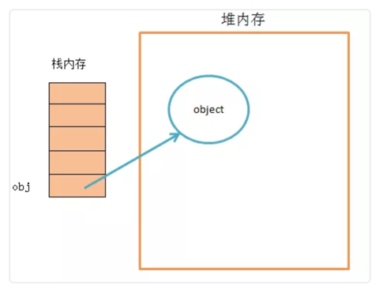
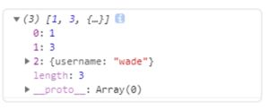

# 深拷贝vs浅拷贝

JavaScript 浅拷贝与深拷贝

## JavaScript 浅拷贝与深拷贝

**一、数据类型**

数据分为基本数据类型\(String, Number, Boolean, Null, Undefined，Symbol\)和对象数据类型。

* 基本数据类型的特点：直接存储在栈\(stack\)中的数据
* 引用数据类型的特点：**存储的是该对象在栈中引用，真实的数据存放在堆内存里**

引用数据类型在栈中存储了指针，该指针指向堆中该实体的起始地址。当解释器寻找引用值时，会首先检索其在栈中的地址，取得地址后从堆中获得实体。



**二、浅拷贝与深拷贝**

**深拷贝和浅拷贝是只针对Object和Array这样的引用数据类型的**。

深拷贝和浅拷贝的示意图大致如下： 

**浅拷贝只复制指向某个对象的指针，而不复制对象本身，新旧对象还是共享同一块内存。但深拷贝会另外创造一个一模一样的对象，新对象跟原对象不共享内存，修改新对象不会改到原对象。**

**三、赋值和浅拷贝的区别**

当我们把一个对象赋值给一个新的变量时，**赋的其实是该对象的在栈中的地址，而不是堆中的数据**。也就是两个对象指向的是同一个存储空间，无论哪个对象发生改变，其实都是改变的存储空间的内容，因此，两个对象是联动的。

浅拷贝是按位拷贝对象，**它会创建一个新对象**，这个对象有着原始对象属性值的一份精确拷贝。如果属性是基本类型，拷贝的就是基本类型的值；如果属性是内存地址（引用类型），拷贝的就是内存地址 ，因此如果其中一个对象改变了这个地址，就会影响到另一个对象。即默认拷贝构造函数只是对对象进行浅拷贝复制\(逐个成员依次拷贝\)，即只复制对象空间而不复制资源。

我们先来看两个例子，对比赋值与浅拷贝会对原对象带来哪些改变？

```javascript
// 对象赋值
var obj1 = {
name: 'zhangsan',
age: '18',
language: [1, [2, 3], [4, 5]],
};
var obj2 = obj1;
obj2.name = 'lisi';
obj2.language[1] = ['二', '三'];
console.log('obj1', obj1);
console.log('obj2', obj2);
```


```javascript
// 浅拷贝
var obj1 = {
name: 'zhangsan',
age: '18',
language: [1, [2, 3], [4, 5]],
};
var obj3 = shallowCopy(obj1);
obj3.name = 'lisi';
obj3.language[1] = ['二', '三'];
function shallowCopy(src) {
var dst = {};
for (var prop in src) {
if (src.hasOwnProperty(prop)) {
dst[prop] = src[prop];
}
}
return;
dst;
}
console.log('obj1', obj1);
console.log('obj3', obj3);
```


上面例子中，obj1是原始数据，obj2是赋值操作得到，而obj3浅拷贝得到。我们可以很清晰看到对原始数据的影响，具体请看下表：


**四、浅拷贝的实现方式**

**1、Object.assign\(\)**

`Object.assign()` 方法可以把任意多个的源对象自身的可枚举属性拷贝给目标对象，然后返回目标对象。但是 `Object.assign()` 进行的是浅拷贝，拷贝的是对象的属性的引用，而不是对象本身。

```javascript
var obj = { a: { a: 'kobe', b: 39 } };
var initalObj = Object.assign({}, obj);
initalObj.a.a = 'wade';
console.log(obj.a.a);//wade
```

注意：**当object只有一层的时候，是深拷贝**

```javascript
let obj = {
username: 'kobe',
};
let obj2 = Object.assign({}, obj);
obj2.username = 'wade';
console.log(obj);//{username: "kobe"}
```

**2、Array.prototype.concat\(\)**

```javascript
let arr = [
1,
3,
{
username: 'kobe',
},
];
let arr2 = arr.concat();
arr2[2].username = 'wade';
console.log(arr);
```

修改新对象会改到原对象：


**3、Array.prototype.slice\(\)**

```javascript
let arr = [
1,
3,
{
username: ' kobe',
},
];
let arr3 = arr.slice();
arr3[2].username = 'wade';
console.log(arr);
```

同样修改新对象会改到原对象： 

