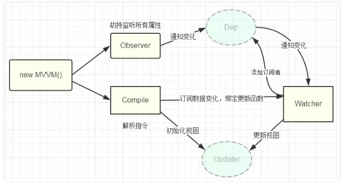

# 双向数据绑定 MVVM

## 双向数据绑定

**数据劫持结合发布者-订阅者** 的方式，通过 **Object.defineProperty（）** 来 **劫持** 各个属性的setter，getter，在 **数据变动时,发布消息给订阅者，触发相应监听回调。**

vue的数据双向绑定 将MVVM作为数据绑定的入口，整合Observer，Compile和Watcher三者，通过Observer来监听自己的model的数据变化，通过Compile来解析编译模板指令（vue中是用来解析 ），最终利用watcher搭起observer和Compile之间的通信桥梁，达到数据变化 —&gt;视图更新；视图交互变化（input）—&gt;数据model变更双向绑定效果。

### 具体步骤：

第一步：需要 observe 的数据对象进行递归遍历，包括子属性对象的属性，都加上 setter 和 getter 这样的话，给这个对象的某个值赋值，就会触发 setter，那么就能监听到了数据变化

第二步：compile 解析模板指令，将模板中的变量替换成数据，然后初始化渲染页面视图，并将每个指令对应的节点绑定更新函数，添加监听数据的订阅者，一旦数据有变动，收到通知，更新视图

第三步：Watcher 订阅者是 Observer 和 Compile 之间通信的桥梁，主要做的事情是:

* 在自身实例化时往属性订阅器\(dep\)里面添加自己
* 自身必须有一个 update\(\)方法
* 待属性变动 dep.notice\(\)通知时，能调用自身的 update\(\) 方法，并触发 Compile 中绑定的回调，则功成身退。

第四步：MVVM 作为数据绑定的入口，整合 Observer、Compile 和 Watcher 三者，通过 Observer 来监听自己的 model 数据变化，通过 Compile 来解析编译模板指令，最终利用 Watcher 搭起 Observer 和 Compile 之间的通信桥梁，达到数据变化 -&gt; 视图更新；视图交互变化\(input\) -&gt; 数据 model 变更的双向绑定效果。

## 什么是MVVM？

MVVM 是 Model-View-ViewModel 的缩写。

mvvm 是一种设计思想。

Model 层代表数据模型，也可以在 Model 中定义数据修改和操作的业务逻辑；

View 代表 UI 组件，它负责将数据模型转化成 UI 展现出来，

ViewModel 是一个同步 View 和 Model 的对象。

在 MVVM 架构下，View 和 Model 之间并没有直接的联系，而是通过 ViewModel 进行交互，Model 和 ViewModel 之间的交互是双向的， 因此 View 数据的变化会同步到 Model 中，而 Model 数据的变化也会立即反应到 View 上。

ViewModel 通过双向数据绑定把 View 层和 Model 层连接了起来，而 View 和 Model 之间的同步工作完全是自动的，无需人为干涉，因此开发者只需关注业务逻辑，不需要手动操作 DOM, 不需要关注数据状态的同步问题，复杂的数据状态维护完全由 MVVM 来统一管理。

## MVVM和MVC的区别：

mvc 和 mvvm 其实区别并不大。都是一种设计思想。主要就是 mvc 中 Controller 演变成 mvvm 中的 viewModel。mvvm 主要解决了 mvc 中大量的 DOM 操作使页面渲染性能降低，加载速度变慢，影响用户体验。和当 Model 频繁发生变化，开发者需要主动更新到 View 。

